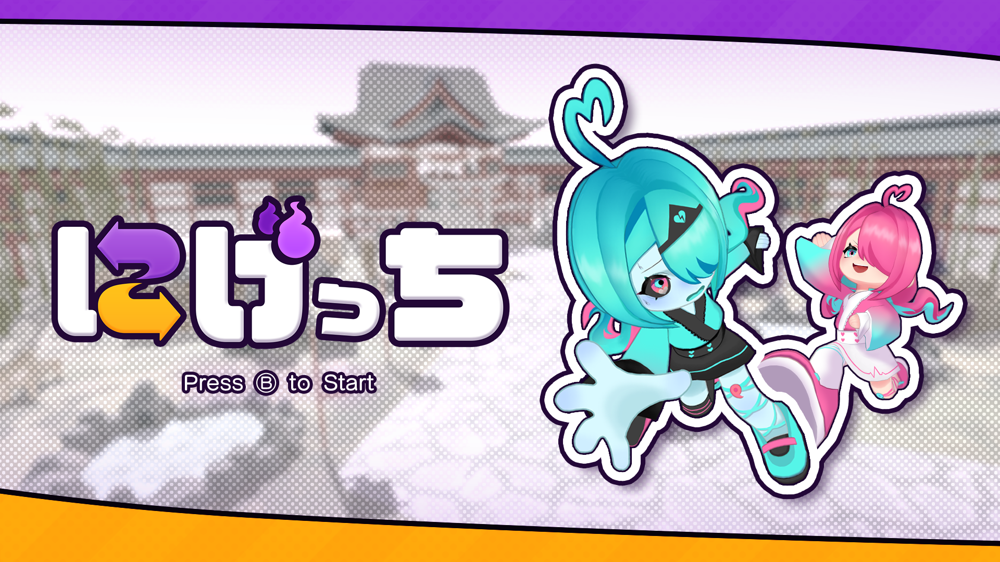
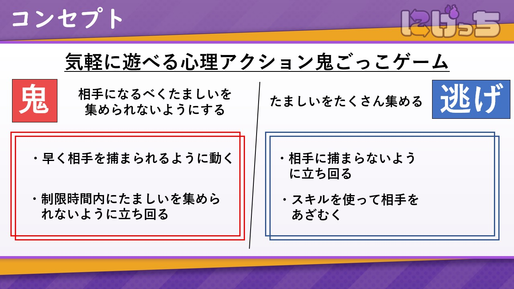
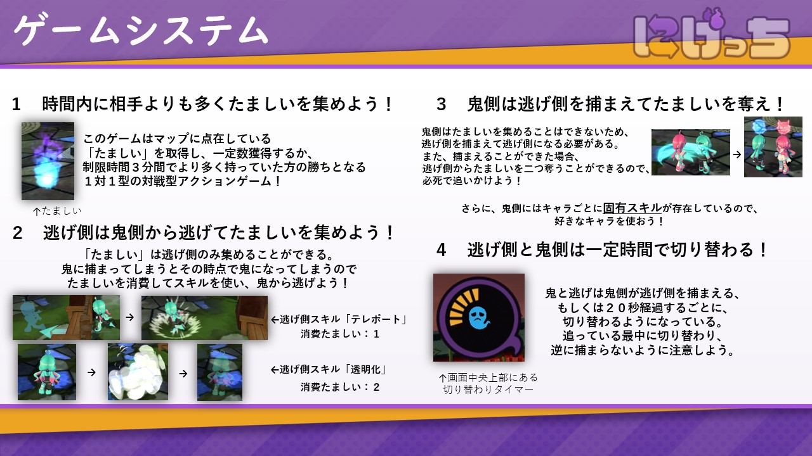
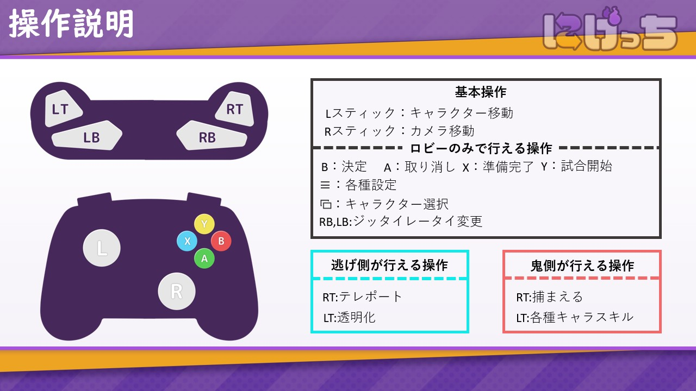

# にげっち
2年次にチーム制作で作った2人で対戦するオンライン鬼ごっこゲームです。<br>
オンラインゲームに初めて挑戦した作品です。<br>
&nbsp;


## 概要
UnityとPhotonFusionを使用して制作した、リアルタイム通信のオンラインアクションゲームです。<br>
プレイヤー入力は NetworkInputData を用いてネットワーク同期し、複数クライアント間で同一のゲーム挙動を再現しています。<br>
また、ゲーム進行は GameDirector によって各シーンを管理しています。<br>
&nbsp;




## 動作デモ
https://youtu.be/oRcOt79kO1s

## 使用技術
- Unity 2022.3.19f1
- C#
- Photon Fusion / DOTween / UniTask / Cinemachine

## 制作期間
6ヶ月

## 制作体制
チーム制作（メインプログラマー担当）

## システム構成
```bash
TitleDirecter
GameDirecter ← オンライン接続
 ├ LobbyDirecter
 ├ SelectDirecter
 ├ BattleDirecter
 └ ResultDirecter
 ```

## 見てほしいコード
- GameDirecter.cs
  `Assets/7.Script/GameDirecter.cs`<br>
ゲーム全体の進行管理
- PlayerController.cs
  `Assets/7.Script/Player/PlayerController.cs`<br>
プレイヤー操作・キャラクターコントロール
- BasicSpawner.cs
  `Assets/7.Script/BasicSpawner.cs`<br>
プレイヤー生成処理
- NetworkInputData.cs
  `Assets/7.Script/NetworkInputData.cs`<br>
プレイヤー入力のネットワーク同期

## 改善点
- CPUの追加
- 同期の最適化