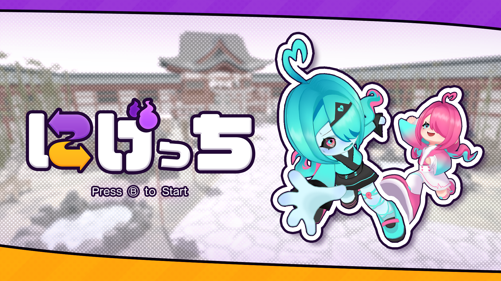
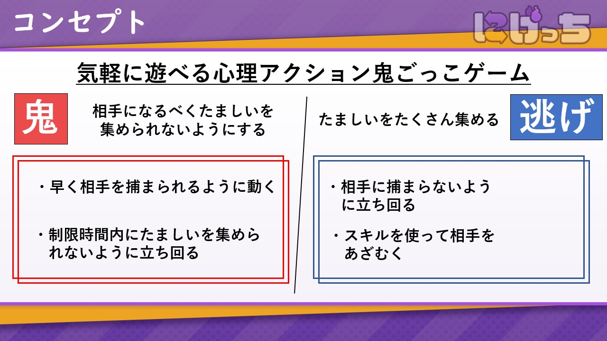
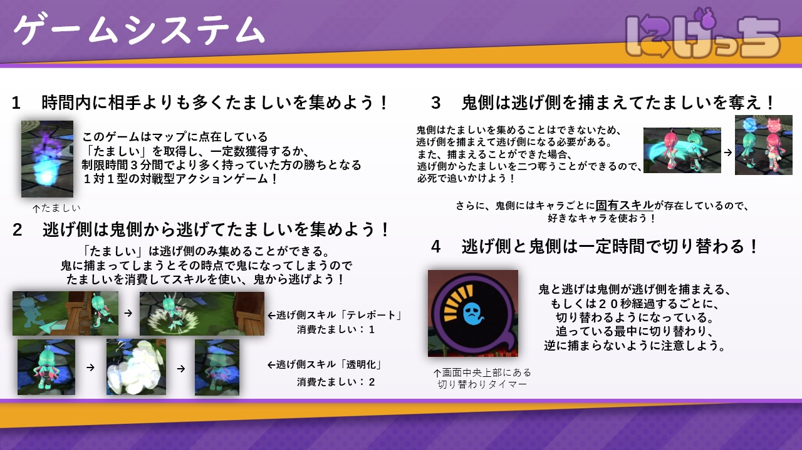
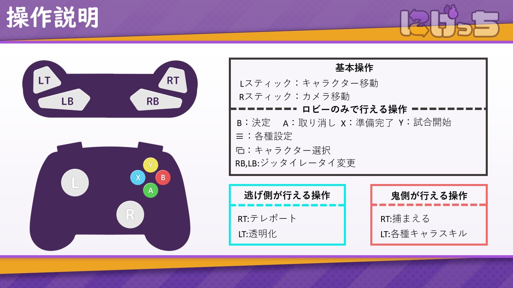

# にげっち
2年次にチーム制作で作った2人で対戦する**オンライン鬼ごっこゲーム**です。<br>
オンラインゲームに初めて挑戦した作品です。<br>
&nbsp;


## 概要
UnityとPhotonFusionを使用して制作した、リアルタイム通信のオンラインアクションゲームです。<br>
現在、ゲーム進行管理スクリプトとPlayerController.csをメインにリファクタリングを行っています。<br>
&nbsp;




## 動作デモ
https://youtu.be/oRcOt79kO1s

## 使用技術
- Unity 2022.3.19f1
- C#
- Photon Fusion / DOTween / UniTask / Cinemachine

## 制作期間
6ヶ月

## 制作体制
チーム制作（メインプログラマー担当）

## システム構成
```bash
TitleDirecter
GameManager ← オンライン接続
 ├ LobbyDirecter
 ├ SelectDirecter
 ├ BattleDirecter
 └ ResultDirecter
 ```

## 見てほしいコード
- GameManager.cs
  `Assets/7.Script/Directer/GameManager.cs`<br>
ゲーム全体の進行管理
- BattleDirecter.cs
  `Assets/7.Script/Directer/BattleDirecter.cs`<br>
試合中の進行管理
- PlayerController.cs
  `Assets/7.Script/Player/PlayerController.cs`<br>
プレイヤー操作・キャラクターコントロール

## 時間があればやりたいこと
- CPUの追加
- 同期の最適化